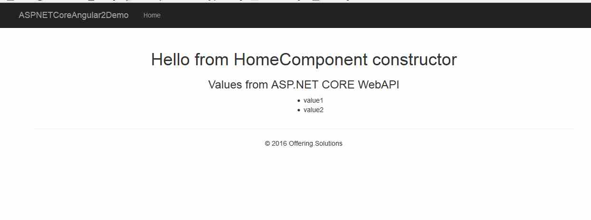

# Angular 2 / ASP.NET CORE 1.0 Starter Template

This is a starter template for developing Angular2 with ASP.NET CORE 1.0 Applications.

This template is done with npm and bower. Its an Angular2 application with an http-service getting values from an ASP.NET CORE WebAPI.

You can copy the js files manually or use the gulp task

<pre>gulp get:started</pre>

Open a cmd, navigate to the folder containing the "project.json" file and type 

<pre>dnx web</pre>

and navigate with a browser to

<pre>http://localhost:5000</pre>

Find my Blogpost about this here:
<a href="http://offering.solutions/articles/asp-net/how-to-start-with-visual-studio-code-angular2-beta-0-typescript-asp-net-core-1-0/">How to start with Visual Studio (Code), Angular2 beta 0, Typescript & ASP.NET Core 1.0 </a>

